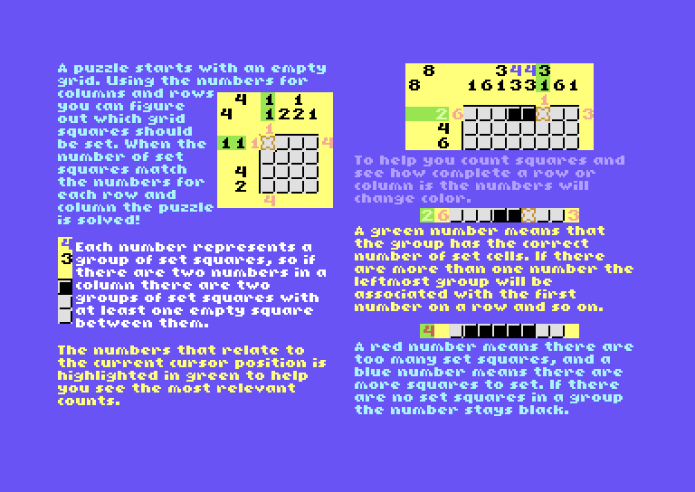

# C64HelpDoc

Make PDF style manuals for C64 games!

Feel free to use and modify, no credits required. This was originally created for Nono Pixie from Space Moguls by Carl-Henrik Skårstedt.

## Notes

* This is the help tool I made for Nono Pixie
* Nono Pixie help files are included for reference
* Sparsely documented but I hope it is enough
* The max width of things is 255 pixels, so full width images need to be split up and to fill the screen you need at least two text columns.

## Create the sample doc and run it

If using windows just run the make_sample.bat file, this will build sample.prg which you can just run in VICE!

There is also a second sample with a bigger font, use make_sample2.bat to build sample2.prg.

## Compiling HelpConv.exe

This was compiled for 64 bit windows 10 and if you need to compile your own version (or add features) just compile ToolSource\HelpConv.cpp. It has a Visual Studio solution if helpful. I haven't tried to build it on other systems but hopefully it will not cause any errors.

## Compiling / another version of x65

x65 is the assembler this code is assembled with, you should be able to easily change the code and tool if you want something else, but if you need another version of x65 go to github.com/sakrac/x65

## Diving In

Check out the files in the Sample folder, you'll see a bunch of .png files and a .txt file.

Obviously open up the .txt file and check what's there...

At the top I'm declaring names and image files, most of these should make sense, but then there is one that comes with braces. This is a sprite image so you'll see a filename followed by sprite commands. Each sprite command will generate a sprite overlay from the original image.

The first number is the color to use for a sprite, then the top x and y position of that sprite in the image. When all the sprites have been removed what remains will be converted to a single color bitmap image.

The format for all the images are the same as C64 single color bitmap but not fullscreen.

Next is the Font declaration, the characters in the font should be drawn to an 8x8 grid but don't worry about leaving space. You can have multiple fonts (although I haven't tried that yet).

## Style declarations

I didn't want to type in stuff for each bit of text so I created a style command to make preset styles, this includes the font and the spacing for that style.

## The Document

Here follow the pages, there are some useful commands you can use. Note that it is drawn in the order you add commands so you get some control for drawing order.

Each page is the contents of one screen.

* Image: specify top/left position, should be aligned to 8x8 and the name of the image from the top of the file.
* Block: A block of text, specifies left/top/right/bottom and has sub commands:
	- Style: which style to use. Can change between paragraphs
	- color for pen and background. Can change between paragraphs
	- Paragraph: A paragraph of text, use another Paragraph for line breaks.
	- Divider: Adds more space between paragraphs

## Questions

Don't hesitate to ask me if you have questions, I know the documentation and comments are perhaps not fully helpful and I'm happy to add more comments and explanations here and there to this repo.